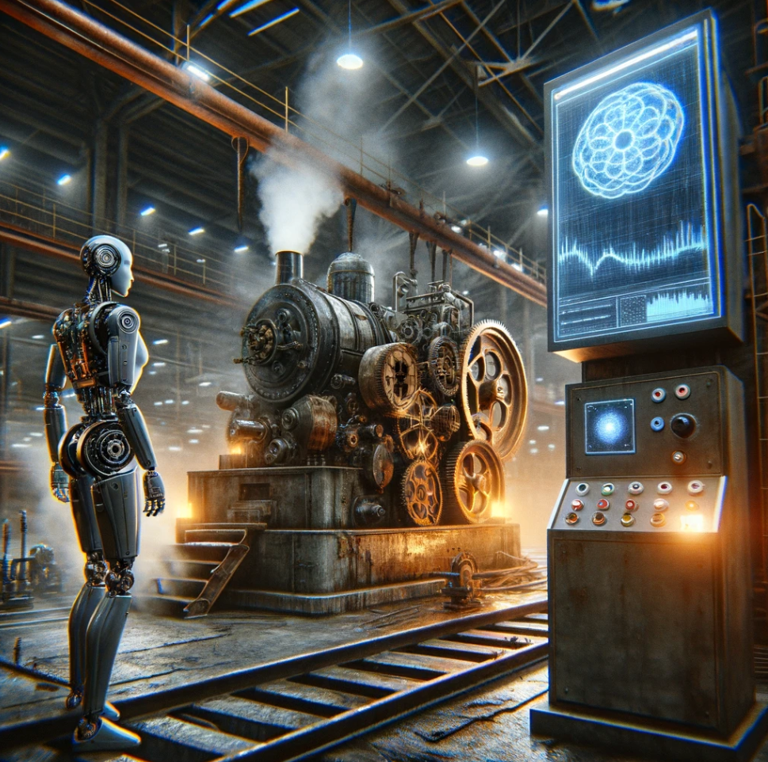

# Predictive Maintenance
## Supervised and Unsupervised Machine Learning for Predictive Maintenance

<!--
*** Written by Martin Karlsson
*** www.martinkarlsson.io
-->

[![LinkedIn][linkedin-shield]][linkedin-url]

<!-- ABOUT THE PROJECT -->
## About The Project

 
Intention with this project is to provide a boilerplate for creating a predictive maintenance service. The project is divided into two parts, supervised and unsupervised machine learning. The supervised part will consider confirmed failures while the unsupervised part will look for anomalies in the sensor data that could indicate a failure. The unsupervised will look at the sensor data as a whole and how they correlate with each other.
<!-- CONTACT -->
## Contact

### Martin Karlsson

LinkedIn : [martin-karlsson][linkedin-url] \
Twitter : [@HelloKarlsson](https://twitter.com/HelloKarlsson) \
Email : hello@martinkarlsson.io \
Webpage : [www.martinkarlsson.io](https://www.martinkarlsson.io)

Project Link: [github.com/martinkarlssonio/predictive-maintenance](https://github.com/martinkarlssonio/predictive-maintenance)

<!-- MARKDOWN LINKS & IMAGES -->
[linkedin-shield]: https://img.shields.io/badge/-LinkedIn-black.svg?style=for-the-badge&logo=linkedin&colorB=555
[linkedin-url]: https://linkedin.com/in/martin-karlsson